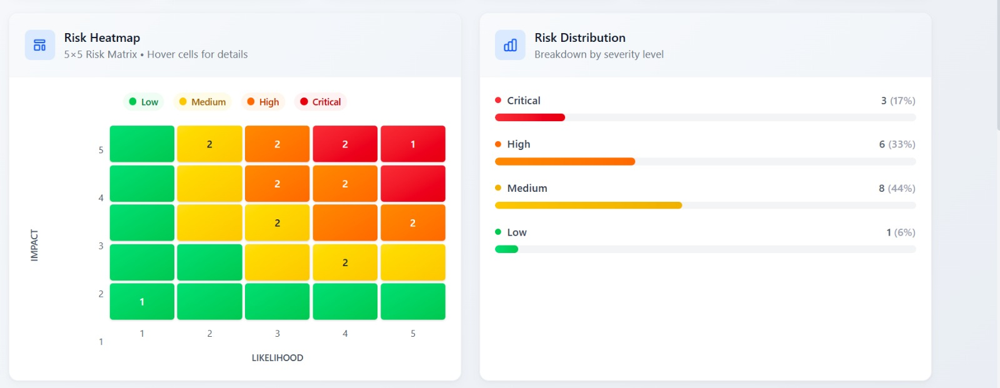
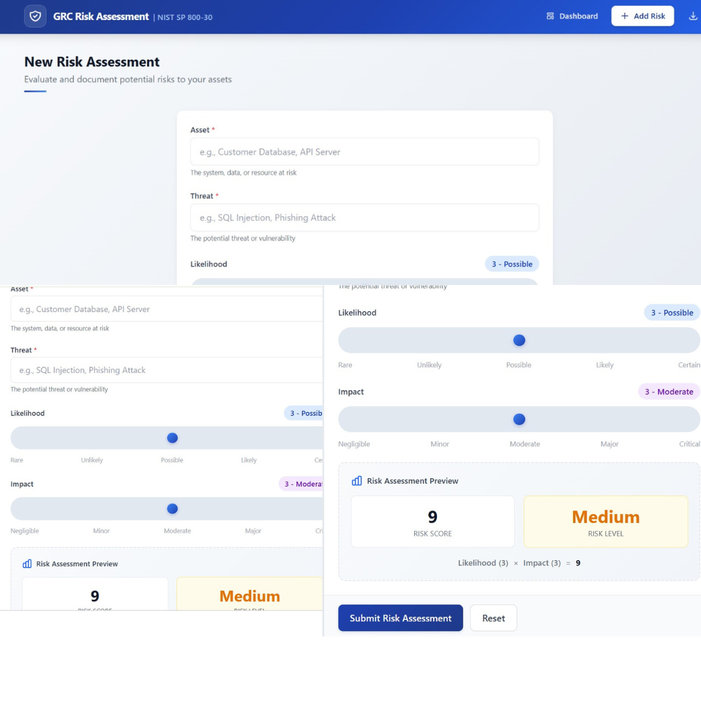

# GRC Risk Assessment & Heatmap Dashboard

https://grc-risk-task-harshit-singh-1.onrender.com/

A full-stack web application for Governance, Risk, and Compliance (GRC) risk assessment using the standard **likelihood × impact** risk matrix methodology aligned with **NIST SP 800-30**.


## 📋 Overview

This application enables organizations to:
- **Assess risks** by evaluating likelihood and impact scores (1-5 scale)
- **Automatically calculate** risk scores and categorize levels (Low/Medium/High/Critical)
- **Visualize risks** through an interactive 5×5 heatmap matrix
- **Track and manage** risks with sortable, filterable tables
- **Export data** to CSV for compliance reporting
- **Receive mitigation hints** based on NIST guidelines

### Risk Matrix Methodology

The application uses the industry-standard risk calculation:

| Score Range | Level    | Color  | Recommended Action                                    |
|-------------|----------|--------|-------------------------------------------------------|
| 1-5         | Low      | Green  | Accept / monitor - Review during next audit cycle     |
| 6-12        | Medium   | Yellow | Plan mitigation within 6 months                       |
| 13-18       | High     | Orange | Prioritize action + implement compensating controls   |
| 19-25       | Critical | Red    | Immediate mitigation required + executive reporting   |

## 🏗️ Project Structure

```
grc-risk-tool/
├── backend/
│   ├── app.py              # FastAPI application with all endpoints
│   ├── requirements.txt    # Python dependencies
│   └── risks.db            # SQLite database (auto-created)
├── frontend/
│   ├── index.html          # HTML entry point with mobile meta tags
│   ├── src/
│   │   ├── App.jsx         # Main React component with navigation
│   │   ├── main.jsx        # React entry point
│   │   ├── index.css       # Tailwind CSS v4 with responsive utilities
│   │   ├── utils/
│   │   │   └── riskScoring.js  # Shared risk scoring utilities
│   │   └── components/
│   │       ├── RiskForm.jsx     # Risk input form with real-time preview
│   │       ├── Dashboard.jsx    # Main dashboard layout
│   │       ├── RiskTable.jsx    # Sortable/searchable/filterable risk table
│   │       ├── Heatmap.jsx      # Interactive 5×5 heatmap with tooltips
│   │       └── StatsCards.jsx   # Summary statistics cards
│   ├── tests/
│   │   └── riskScoring.test.js  # 29 unit tests for scoring functions
│   ├── package.json
│   └── vite.config.js
├── screenshots/             # README images (dashboard, table, form)
└── README.md
```

## 🚀 Quick Start (Copy-Paste Ready)

### Prerequisites
- **Python 3.8+** with pip
- **Node.js 16+** with npm
- **Git** (to clone repo)

### Step 1: Clone the Repository
```bash
git clone https://github.com/yourusername/grc-risk-tool.git
cd grc-risk-tool
```

### Step 2: Start Backend (Terminal 1)
```bash
cd backend
pip install -r requirements.txt
uvicorn app:app --reload --port 8000
```
✅ API running at `http://localhost:8000`  
📚 Swagger docs at `http://localhost:8000/docs`

### Step 3: Start Frontend (Terminal 2)
```bash
cd frontend
npm install
npm run dev
```
✅ Dashboard running at `http://localhost:3000`

### Step 4: Run Tests (Optional)
```bash
cd frontend
npm run test:run    # 29 tests should pass
```

---

## 📸 Screenshots

### Dashboard with Risk Heatmap & Statistics


*The main dashboard displays:*
- **Statistics cards** showing total risks, average score, and breakdown by severity level
- **5×5 Risk Heatmap** with color-coded cells (green → yellow → orange → red)
- **Risk Distribution** chart with percentage breakdowns

### Risk Assessment Table with Search & Filters


*The risk register table features:*
- **Search bar** to filter by asset name, threat, or score
- **Level filter dropdown** (All/Low/Medium/High/Critical)
- **Sortable columns** - click headers to sort
- **Action hints** with NIST-aligned recommendations
- **Delete buttons** for risk removal

### Add Risk Form with Real-Time Preview


*The risk input form includes:*
- Text inputs for asset and threat description
- Interactive sliders for likelihood (1-5) and impact (1-5)
- Real-time score calculation and risk level preview
- Form validation with error messages

---

## 🔧 Detailed Setup Instructions

<details>
<summary><strong>Windows Setup (PowerShell)</strong></summary>

```powershell
# Clone and navigate
git clone https://github.com/yourusername/grc-risk-tool.git
cd grc-risk-tool

# Backend (Terminal 1)
cd backend
python -m pip install -r requirements.txt
python -m uvicorn app:app --reload --port 8000

# Frontend (Terminal 2 - new PowerShell window)
cd grc-risk-tool\frontend
npm install
npm run dev
```
</details>

<details>
<summary><strong>macOS/Linux Setup (Bash)</strong></summary>

```bash
# Clone and navigate
git clone https://github.com/yourusername/grc-risk-tool.git
cd grc-risk-tool

# Backend (Terminal 1)
cd backend
python3 -m venv venv
source venv/bin/activate
pip install -r requirements.txt
uvicorn app:app --reload --port 8000

# Frontend (Terminal 2)
cd ../frontend
npm install
npm run dev
```
</details>

<details>
<summary><strong>Virtual Environment (Recommended)</strong></summary>

```bash
cd backend
python -m venv venv

# Activate:
# Windows: venv\Scripts\activate
# macOS/Linux: source venv/bin/activate

pip install -r requirements.txt
uvicorn app:app --reload --port 8000
```
</details>

## 📡 API Endpoints

| Method | Endpoint            | Description                              |
|--------|---------------------|------------------------------------------|
| GET    | `/`                 | API info and available endpoints         |
| POST   | `/assess-risk`      | Submit a new risk assessment             |
| GET    | `/risks`            | Get all risks (optional `?level=` filter)|
| GET    | `/risks/stats`      | Get summary statistics                   |
| DELETE | `/risks/{risk_id}`  | Delete a specific risk                   |

### Example: Submit Risk Assessment

```bash
curl -X POST http://localhost:8000/assess-risk \
  -H "Content-Type: application/json" \
  -d '{
    "asset": "Customer Database",
    "threat": "SQL Injection Attack",
    "likelihood": 4,
    "impact": 5
  }'
```

**Response:**
```json
{
  "id": 1,
  "asset": "Customer Database",
  "threat": "SQL Injection Attack",
  "likelihood": 4,
  "impact": 5,
  "score": 20,
  "level": "Critical",
  "hint": "Immediate mitigation required + executive reporting - Escalate to CISO"
}
```

## ✨ Features

### Risk Input Form
- Text inputs for asset name and threat description
- Interactive sliders for likelihood (1-5) and impact (1-5)
- **Real-time preview** showing calculated score and risk level
- Form validation with clear error messages
- Success feedback with automatic redirect to dashboard
- **Touch-friendly** sliders on mobile devices

### Dashboard
- **Statistics Cards**: Total risks, Average score, Critical/High/Medium/Low counts
  - Colorful gradient backgrounds
  - Responsive grid (2 cols → 3 cols → 6 cols)
- **5×5 Heatmap**: Visual representation of risk distribution
  - Color-coded cells (green → yellow → orange → red)
  - Hover/tap tooltips showing risk count and asset names
  - Touch support for mobile devices
  - Scrollable on small screens
- **Risk Distribution Chart**: Progress bars showing count by level
- **Risk Register Table**:
  - Sortable columns (click headers)
  - **Search bar** for filtering by asset, threat, or score
  - **Level filter dropdown**
  - Mitigation hints column with NIST guidance
  - Delete action per row
  - **Mobile card view** with touch-friendly buttons

### Responsive Design
- **Fully responsive** for iOS, Android, Windows, and all screen sizes
- Mobile-first CSS with Tailwind breakpoints (sm/md/lg)
- Touch-friendly tap targets (48px minimum)
- Safe area insets for iPhone notch/home indicator
- Smooth momentum scrolling on iOS
- Collapsible mobile navigation menu

### Data Export
- CSV export with all risk data
- Includes: ID, Asset, Threat, Likelihood, Impact, Score, Level

## 🔒 GRC Compliance Context

This application supports GRC workflows by implementing:

1. **NIST SP 800-30** - Risk Assessment methodology
   - The 5×5 likelihood/impact matrix is a core component of NIST risk assessment guidelines

2. **ISO 27001** - Information Security Risk Assessment
   - Provides risk identification and evaluation capabilities required for ISMS

3. **Risk Treatment Planning**
   - Mitigation hints guide users toward appropriate responses based on risk level

### Example Use Cases
- **IT Security Teams**: Assess cybersecurity risks across assets
- **Compliance Officers**: Document and prioritize compliance gaps
- **Risk Managers**: Maintain enterprise risk registers
- **Auditors**: Review and export risk assessment data

## 🧪 Testing

### Unit Tests (29 tests)

Run the test suite:
```bash
cd frontend
npm test        # Watch mode
npm run test:run # Single run
```

**Test Coverage:**
- `calculateScore` - 5 tests (score calculation, boundary values, error handling)
- `calculateLevel` - 6 tests (level thresholds, boundary conditions)
- `getMitigationHint` - 5 tests (hint text per level)
- `assessRisk` - 7 tests (complete assessment workflow)
- `RISK_THRESHOLDS` - 1 test (threshold constants)
- `LIKELIHOOD_LABELS` - 1 test (label arrays)
- `IMPACT_LABELS` - 1 test (label arrays)
- `Risk Matrix Coverage` - 3 tests (all 25 matrix combinations)

### Manual Testing Checklist

1. **Add 5-10 sample risks** with varying likelihood/impact combinations
2. **Verify score calculation**: Score = Likelihood × Impact
3. **Verify level assignment**:
   - 1-5 → Low
   - 6-12 → Medium
   - 13-18 → High
   - 19-25 → Critical
4. **Test heatmap**:
   - Cells show correct counts
   - Hover tooltips display asset names
   - Colors match risk levels
5. **Test table sorting**: Click column headers
6. **Test filtering**: Use level dropdown
7. **Test CSV export**: Verify file downloads with correct data

### Sample Test Data

```json
[
  {"asset": "Web Server", "threat": "DDoS Attack", "likelihood": 3, "impact": 4},
  {"asset": "Customer Database", "threat": "Data Breach", "likelihood": 4, "impact": 5},
  {"asset": "Email System", "threat": "Phishing", "likelihood": 5, "impact": 3},
  {"asset": "Backup Server", "threat": "Hardware Failure", "likelihood": 2, "impact": 3},
  {"asset": "API Gateway", "threat": "Unauthorized Access", "likelihood": 3, "impact": 4}
]
```

## 🛠️ Technical Stack

### Backend
- **FastAPI** for high-performance async API
- **SQLite** for simple, file-based persistence
- **Pydantic** for request/response validation
- **CORS** enabled for frontend integration
- **Uvicorn** ASGI server

### Frontend
- **React 18** with functional components and Hooks
- **Vite 5.4** for fast development builds
- **Tailwind CSS v4** with `@tailwindcss/vite` plugin
- **Vitest 4.0** for unit testing (29 tests)
- **Responsive design** for all devices (iOS, Android, Windows)

### UI/UX Features
- Professional blue GRC theme with gradients
- Custom range slider styling
- Card-based layouts with subtle shadows
- Mobile-first responsive breakpoints
- Touch-optimized interactions
- Safe area support for modern mobile devices

### Edge Cases Handled
- Empty database returns empty array
- Invalid likelihood/impact values return HTTP 400
- Concurrent requests supported (SQLite connection per request)
- Large datasets (50+ risks) display without performance issues
- Touch and mouse interactions supported simultaneously

## 📝 Assumptions

| Assumption | Rationale |
|------------|----------|
| **No authentication** | Single-user local development; auth would add complexity without value for demo |
| **SQLite database** | File-based persistence suitable for moderate data volumes; no setup required |
| **Local environment only** | CORS configured for localhost; production would need environment variables |
| **Modern browser required** | ES6+ JavaScript features used; tested on Chrome, Firefox, Safari, Edge |
| **No persistent sessions** | Risk data stored in SQLite; no cookies or local storage for user state |
| **Single timezone** | Timestamps use server time; no timezone conversion implemented |

---

## 💡 Challenges & Technical Notes

### Challenges Faced

1. **Async API Calls with useEffect**
   - Challenge: Race conditions when rapidly switching between tabs while data was loading
   - Solution: Used `useCallback` for memoized fetch functions and proper cleanup patterns

2. **Tailwind CSS v4 Migration**
   - Challenge: Tailwind v4 uses new `@tailwindcss/vite` plugin, different from v3 PostCSS setup
   - Solution: Removed `postcss.config.js` and `tailwind.config.js`, configured via `vite.config.js`

3. **Responsive Heatmap on Mobile**
   - Challenge: 5×5 grid was too small for touch interaction on mobile devices
   - Solution: Added touch event handlers, tap-to-toggle tooltips, and horizontal scroll for small screens

4. **Risk Level Boundary Cases**
   - Challenge: Score of 12 could be Medium or High depending on interpretation
   - Solution: Aligned with NIST SP 800-30 thresholds (1-5 Low, 6-12 Medium, 13-18 High, 19-25 Critical)

5. **Stats API Field Naming**
   - Challenge: Backend returned `total` but frontend expected `total_risks`
   - Solution: Updated frontend to use `stats.total` to match API response schema

### Edge Cases Tested

| Test Case | Expected Behavior | Status |
|-----------|-------------------|--------|
| Empty database | Shows "No risks" message, empty heatmap | ✅ |
| Score = 1 (min) | Level = Low, green color | ✅ |
| Score = 25 (max) | Level = Critical, red color | ✅ |
| Score = 12 (boundary) | Level = Medium (upper boundary) | ✅ |
| Score = 13 (boundary) | Level = High (lower boundary) | ✅ |
| Invalid likelihood (0 or 6) | HTTP 400 error returned | ✅ |
| 50+ risks in table | Smooth scrolling, no lag | ✅ |
| Mobile touch on heatmap | Tooltip appears on tap | ✅ |
| Empty search results | Shows "0 results found" | ✅ |
| Delete while loading | Button disabled, spinner shown | ✅ |

### Bonus Features Implemented

- ✅ **Search bar** with real-time filtering across all fields
- ✅ **Level filter dropdown** for quick severity filtering  
- ✅ **29 unit tests** covering all scoring functions and edge cases
- ✅ **CSV export** with one-click download
- ✅ **Fully responsive** design for iOS, Android, Windows
- ✅ **Touch-friendly** 48px tap targets on mobile
- ✅ **Heatmap tooltips** showing asset names on hover/tap
- ✅ **NIST-aligned hints** in mitigation column
- ✅ **Professional gradient theme** with custom slider styling

## 🔮 Future Enhancements

- User authentication and role-based access
- Risk history and audit trail
- Custom risk categories and tags
- API for bulk import/export
- Advanced analytics and trending
- Integration with ticketing systems

## 📄 License

This project is created for educational and demonstration purposes.

---

**Author**: GRC Risk Assessment Tool  
**Version**: 2.0.0  
**Last Updated**: February 11, 2026
